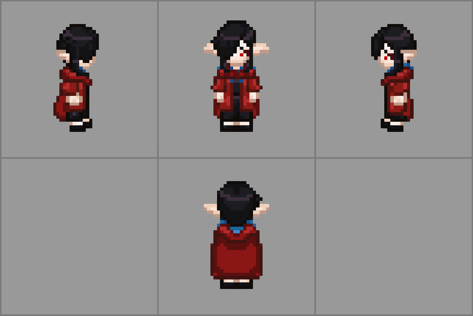

[![foundry-shield]][foundry-url]
[![Forks][forks-shield]][forks-url]
[![Stargazers][stars-shield]][stars-url]
[![Issues][issues-shield]][issues-url]

# Dylan's Animated Tokens Module

## Overview

Installable with this link (through the normal Foundry module interface): `https://github.com/righthandofvecna/dylans-animated-tokens/releases/latest/download/module.json`

This module adds support for Directional Spritesheets for Foundry VTT v13.

## Use
To set up a token to use these animated spritesheets, open the Prototype Token settings and navigate to the **"Appearance"** tab. Set your spritesheet as the token image, check the **"Sheet"** checkbox next to the image path, and then choose the Sheet Style as appropriate.

### Nihey Spritesheets
To use a spritesheet generated by [Nihey's Retro Sprite Creator](https://retro-sprite-creator.nihey.org/character/new), use the `Nihey` sheet style.

### Universal LPC Spritesheets
To use a spritesheet generated by the [Universal LPC Spritesheet Generator](https://liberatedpixelcup.github.io/Universal-LPC-Spritesheet-Character-Generator), download the spritesheet as a single image, use that as the token image, and set the sheet style to `Universal LPC`.

Because Universal LPC sheets contain so many animations, you may experience performance degradation if you use a large number of these in the same scene. To improve performance, you can isolate the walking animation, reorder the rows, and use one of the other provided sheet styles.

### Memao Spritesheets
To use a spritesheet generated by [Memao Sprite Sheet Creator](https://sleeping-robot-games.itch.io/sprite-sheet-creator), use the `Memao` sheet style. In the Memao creator, be sure to export only Idle, Walk, and Run animations (as this doesn't support others at the moment).

### Top Down Sprite Maker (by Jordan Bunke)
For [TDSM](https://flinkerflitzer.itch.io/tdsm), three sheet styles have been added in this module to support this generator. When exporting, use the default sequencing and layout (horizontal animation orientation, and don't check `multiple animations per row`).

[foundry-shield]: https://img.shields.io/badge/Foundry-v13.351-success
[foundry-url]: https://foundryvtt.com/
[forks-shield]: https://img.shields.io/github/forks/righthandofvecna/dylans-animated-tokens.svg
[forks-url]: https://github.com/righthandofvecna/dylans-animated-tokens/network/members
[stars-shield]: https://img.shields.io/github/stars/righthandofvecna/dylans-animated-tokens.svg
[stars-url]: https://github.com/righthandofvecna/dylans-animated-tokens/stargazers
[issues-shield]: https://img.shields.io/github/issues/righthandofvecna/dylans-animated-tokens.svg
[issues-url]: https://github.com/righthandofvecna/dylans-animated-tokens/issues
